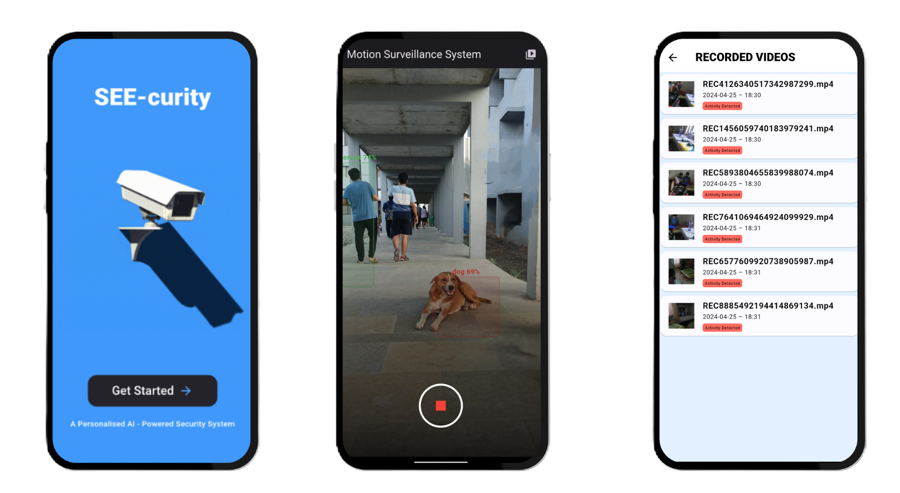

# SEE-Curity: AI Powered Security

## The Problem:
<h4>Video surveillance systems, now ubiquitous in public, commercial, and residential spaces, effectively deter crime and aid investigations. However, high-resolution cameras and continuous recording generate vast data volumes, often including long periods of inactivity. This redundancy creates substantial storage challenges, ultimately compromising the efficiency and effectiveness of these systems.</h4>

## Our Solution:
<h3>To combat this problem, we have come up with SEE-curity, a system that: </h3
<h4>
1. Detects human presence within the CCTV camera's field of view using computer vision sophisticated Machine Learning Model. 
2.Initiates video recording only when a human is detected . 
3.Works on any video from any device, no need of extra sensors . 
4.Local processing of video stream, no cloud costs. 
</h4>

## Screenshots:

## Install the app:

Click [Here](http://www.google.fr/) to download 
 

